<div align="center">



<br />

[](https://www.linkedin.com/in/somil-athole/)
[](https://somil-athole.netlify.app)
[](mailto:sathole2001@gmail.com)
[](https://github.com/somil14?tab=followers)

<br />

**Full-Stack Software Engineer · API Security · GenAI Integrations**

<sub>MERN · TypeScript · Next.js · PostgreSQL · Redis · cloud-native SaaS · Chrome extensions</sub>

Software Engineer at Fusion Tech (TraQez) · working on **Corefix**, an API security platform

</div>

<div align="center">

**Open-source, merged and live**

[**Compiler Explorer**](https://github.com/compiler-explorer/compiler-explorer) · [`#9220` merged](https://github.com/compiler-explorer/compiler-explorer/pull/9220) · running on [godbolt.org](https://godbolt.org)

<sub>Stars belong to the repository, not to me · every claim below links to its source</sub>

</div>

## Building now

**At work: [Corefix](#the-build-stack)**, API security tooling that turns raw browser and API traffic into findings a team can act on: what changed, what leaked, and what nobody documented.

**On my own time:**

1. **[BranchHub](#-branchhub)**: a Chrome extension that captures the decisions buried in long AI chats. Published on the Chrome Web Store.
2. **[SentinelParse](#%EF%B8%8F-sentinelparse)**: a security-focused AI chat parser and exporter with inline PII highlighting and risk badges.
3. **[Compiler Explorer](#open-source-impact-verified)**: fixing bugs upstream in the online compiler sandbox behind godbolt.org.

[Inspect the open-source work](#open-source-impact-verified) · [Explore the build stack](#the-build-stack) · [See the working set](#working-set)

## Ship the product. Then prove it's safe.

I'm a full-stack engineer who works where **product engineering meets security tooling**. I build the whole path: the browser extension that captures traffic, the pipeline that ingests it, the API that analyzes it, and the dashboard that makes the result obvious.

Most of my work starts with one question: **what is this application actually sending over the wire, and should it be?**

```text
capture   → browser extensions record real API traffic (HAR, sessions, context)
ingest    → signed uploads, batching and queues that survive real load
analyze   → schema drift, shadow APIs, JWT exposure, CORS misconfigurations
surface   → dashboards and alerts a developer can act on in minutes
```

## Open-source impact, verified

| Project | Contribution | Status | Area |
|:--|:--|:--:|:--|
| **[Compiler Explorer](https://github.com/compiler-explorer/compiler-explorer)** · [godbolt.org](https://godbolt.org) | [**#9220** · Use GCC 6.4.0 toolchain for ICC 18 to fix broken binaries](https://github.com/compiler-explorer/compiler-explorer/pull/9220) |   | C/C++ toolchain config |
| **[Compiler Explorer](https://github.com/compiler-explorer/compiler-explorer)** · [godbolt.org](https://godbolt.org) | [**#9218** · Validate saved layout before restoring it from storage](https://github.com/compiler-explorer/compiler-explorer/pull/9218) |  | TypeScript · frontend resilience |

**#9220:** binaries built with Intel ICC 18 crashed during libc startup ([#1400](https://github.com/compiler-explorer/compiler-explorer/issues/1400)). I traced it to the GCC 6.3.0 install ICC 18 used as its backend toolchain and switched the C and C++ configs to the already-deployed GCC 6.4.0. Merged into `main` and live on godbolt.org: my first open-source contribution.

**#9218:** corrupted or truncated layouts in browser storage could break app startup. Added validation that falls back to the default layout and drops unusable entries, with tests for valid and malformed inputs.

<sub>[Browse all my pull requests](https://github.com/pulls?q=is%3Apr+author%3Asomil14+-user%3Asomil14) · status reflects the time of the last README update</sub>

## The build stack

<table>
<tr>
<td width="50%" valign="top">

### 🛡️ Corefix

API security platform at Fusion Tech (TraQez). I build across the stack: traffic capture, ingest, analysis services and the dashboards security teams work from.

`TypeScript` `Node.js` `React` `API security`

</td>
<td width="50%" valign="top">

### 🔍 DeepTraq AI

Previous team at Fusion Tech. Built a Chrome extension that records HAR traffic, a signed-URL S3 ingest path, and API drift dashboards that show what changed between captures.

`Chrome Extension APIs` `AWS S3` `HAR analysis` `Dashboards`

</td>
</tr>
<tr>
<td width="50%" valign="top">

### 🌿 BranchHub

A chat decision capture tool. Records conversation branches in AI chats and surfaces the decisions that matter, so they don't disappear into a scroll.

`Chrome Extension` `JavaScript` 

</td>
<td width="50%" valign="top">

### 🛡️ SentinelParse

A security-focused AI chat parser and exporter: inline PII highlighting, risk badges, connected-source monitoring and export/alert pipelines.

`Chrome Extension` `Security tooling` `PII detection`

</td>
</tr>
</table>

## What I'm exploring

```text
What is the app really sending?   → traffic capture straight from the browser
Did the API change under us?      → schema drift and shadow API detection
Is that token safe to be there?   → JWT, CORS and PII exposure checks
Can an LLM help triage it?        → GenAI-assisted analysis with a human in the loop
```

The thread through all of it: **security tooling should be as pleasant to use as the products it protects.**

## Working set

<div align="center">


</div>

## In the lab

- **[Photo-AI](https://github.com/somil14/Photo-AI)**: an AI photo app in TypeScript.
- **[Decentralised-Fiver-Solana](https://github.com/somil14/Decentralised-Fiver-Solana)**: a decentralised freelance marketplace on Solana, in TypeScript.
- **[Audio-to-Text-Transcriber](https://github.com/somil14/Audio-to-Text-Transcriber)**: audio-to-text transcription in Python.
- **[Digital Portfolio](https://github.com/somil14/Digital-Portfolio-Next.Js-Typescript)**: my portfolio, built with Next.js and TypeScript.

<sub>[Browse every public repository](https://github.com/somil14?tab=repositories&type=source)</sub>

---

<div align="center">

### Building products that hold up when someone looks closely.

If you work on API security, developer tooling or GenAI products, let's compare notes.

[**Connect on LinkedIn →**](https://www.linkedin.com/in/somil-athole/) &nbsp;&nbsp; [**View portfolio →**](https://somil-athole.netlify.app) &nbsp;&nbsp; [**Email me →**](mailto:sathole2001@gmail.com) &nbsp;&nbsp; [**Follow on GitHub →**](https://github.com/somil14?tab=followers)

<sub>Based in Gurugram, India · B.Tech CSE, VIT Bhopal · building in public</sub>

</div>
